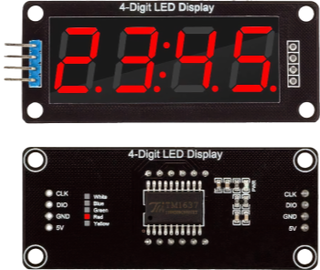

# AVRTiny1_TM1637

This is a library that allows embedded developers working with the tinyAVR® 1-series MCUs to interface these devices to seven-segment LED displays. These devices are commonly found on AliExpress and similar sites as 4 digit modules, though variants are also seen. 

This code is tested with the ATtiny 1616 but other devices in this series should work fine also.



## Usage

You will need to import the library files: `TM1637_TINY1_SMALL.h` and `TM1637_TINY1_SMALL.c` and link them. Modify the following preprocessor definitions in the header file:

- `TM1637_DIO_PORT` - default `(PORTA)`
- `TM1637_CLK_PORT` - default `(PORTA)`
- `TM1637_DIO_MASK` - default `PIN6_bm`
- `TM1637_CLK_MASK` - default `PIN7_bm`

An example application is included. A simplified example follows:

```c
#define F_CPU 20000000UL

#include <avr/io.h>
#include <avr/cpufunc.h> 
#include "TM1637_TINY1_SMALL.h"

int main(void)
{
	/* Disable system clock prescaler */
    ccp_write_io((void *)&(CLKCTRL.MCLKCTRLB), 0x00);

    /* Initialize display interface and clear screen */
    TM1637_init(1, 5, 4);
    TM1637_clear();
	
	/* Display 75.99 on-screen */
    TM1637_display_number_decimal(7599, false, 1);

    while (1) {

    }
}
```


## Acknowledgements

Original copy copyright: Copyright © 2017, Łukasz Marcin Podkalicki <lpodkalicki@gmail.com>. This codebase carried the BSD 2-Clause license which is included here. [Github](https://github.com/lpodkalicki/attiny-tm1637-library)

The code was forked at updated for the Codevision AVR compiler by Pouria Amiri - [Github](https://github.com/pouria-workshop/tm1637-library/tree/master). 

